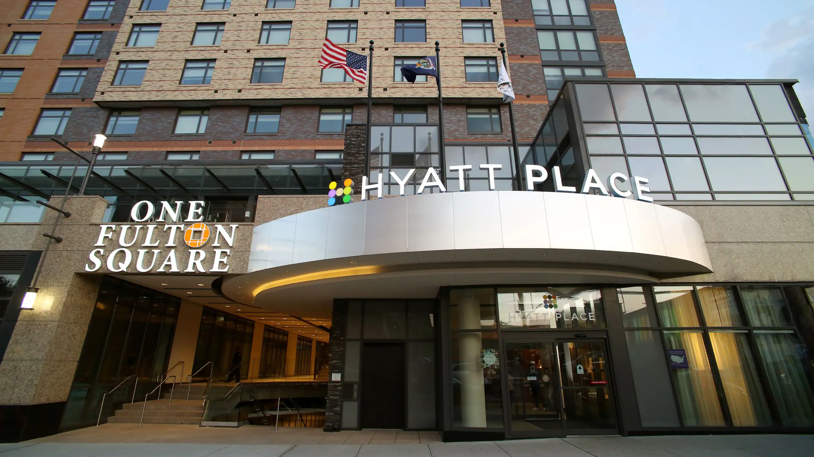

## Background 

I am born and raised in Queens, I currently reside in Jackson Heights where I commute to school. I went to a high school in the Lower East Side and there I first learned about computer science. It was right before 9th grade started and there was a program and I learned HTML and CSS. This wasn't always my interest though, I started college as a Natural Science major on the pre-health track. I have tried out many things by volunteering for this reason.

## Posts
### Hyatt Flushing Hotel

I worked here during the summer of 2022, I got this job through SYEP which is the Summer Youth Employment Program. This was my first job that was in person and taught me many things. It taught me how to approach and deal with difficult situations. We had many customers that were difficult or would get upset and everyone had to excersise patience and tolerance. 

### Flushing Central Leo's Club

I volunteered at the Flushing Central Leo's Club from 2019 to 2021, I was treasurer the last year I was there as well. The Leo's Club is under the Lion's which is more well known, the Leo's is for the younger students. The organization does a lot for the community in Flushing. We would host events and the volunteers would make sure everthing ran smoothly. 

### Junior Achievement 

![junior achievement]

In high school I had the opportunity to become a volunteer and teacher to students for a middle school in the neighborhood, PS 130 Hernado De Soto. 
